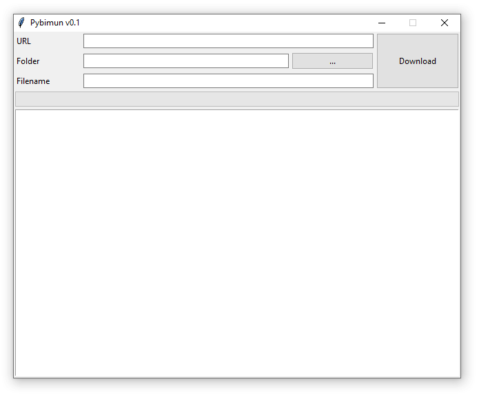

# Pybimun

*Version française en bas*

**Pybimun** is a very simple software that allows you to download full resolution image from the *Bibliothèques Municipales Spécialisées de Paris* website.

It was only tested for pictures, I have strictly no idea how this works for other types of documents.

## How to use Pybimun

It's fairly easy to use: once you have opened the webviewer in your browser, copy the URL to the first field. Then select the folder where you want the image to be downloaded, then in the last field enter the name of the JPG.

Then just click download and hopefully everything will work fine.

If not, fill an issue on GitHub, I'll try to fix it.

# Pybimun

**Pybimun** est un logiciel extrêmement simple qui vous permet de télécharger en pleine résolution les images disponibles sur le site des *Bibliothèques Municipales Spécialisées de Paris*.

Il n'a été testé que pour les images, je n'ai strictement aucune idée de comment ça peut marcher pour les autres types de documents.

## Comment utiliser Pybimun

C'est assez simple d'utilisation : une fois que vous avez ouvert la visionneuse web dans votre navigateur, copiez l'URL dans le premier champ. Ensuite sélectionnez le dossier de destination et entrez dans le dernier champ le nom du JPG.

Il suffit de cliquer sur *Download* et normalement tout va bien se passer.

Si ce n'est pas le cas, rentrer un commentaire sur GitHub, j'essaierai de réparer le soucis.